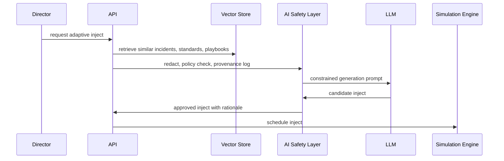

# API Structure

## Core Routes

```http
POST /auth/demo-token
GET /tenants/:tenantId/overview
GET /tenants/:tenantId/audit-events
GET /scenarios
POST /scenarios
GET /scenarios/:scenarioId/injects
POST /simulations/:scenarioId/start
GET /simulations/:sessionId
POST /simulations/:sessionId/advance
POST /simulations/:sessionId/decisions
POST /simulations/:scenarioId/generate-inject
GET /standards/graph
GET /standards/coverage
GET /standards/nodes/:nodeId/related
GET /reports/:scenarioId/after-action
GET /security/status
GET /production/status
GET /enterprise/status
GET /monitoring/status
GET /billing/plans
GET /integrations/status
GET /support/tickets
GET /board/pack
POST /demo-data/:profile/load
GET /sso/config
GET /tenants/provision
POST /tenants/provision
GET /invites
POST /invites
GET /monitoring/metrics
GET /reports/templates/board-pack
GET /training/assignments
GET /marketplace/scenarios
GET /evidence/:artifactId
GET /deployment/assistant
```

## Production API Domains

- `/auth`: SSO, JWT, sessions, service accounts.
- `/tenants`: tenant settings, plans, regions, keys.
- `/users`: identity, RBAC, exercise teams.
- `/scenarios`: templates, builder, objectives, injects, branching rules.
- `/simulations`: live sessions, clock, inject delivery, role responses, websocket channels.
- `/ai`: facilitator, scenario generation, mutation, media injects, report drafting.
- `/standards`: framework library, mappings, coverage, evidence.
- `/analytics`: scores, heatmaps, trend lines, resilience indexes.
- `/reports`: after-action, board briefings, regulator packs, audit exports.
- `/enterprise`: live portal readiness across database, auth, hosting, monitoring, security, data workflows, and polish.
- `/monitoring`: operational health signals for uptime, WebSocket, repository, exports, and docs.
- `/billing`: commercial plan metadata.
- `/integrations`: integration readiness for SIEM, ITSM, comms, email, and SSO.
- `/support`: customer-success ticket surface.
- `/board`: board pack manifest and export links.
- `/demo-data`: demo/sample tenant data controls.

## AI Workflow



## Example Generate Inject Request

```bash
curl -X POST http://localhost:8787/simulations/scn-ai-rag-poisoning/generate-inject \
  -H "Content-Type: application/json" \
  -d "{\"pressure\":\"regulatory\",\"minute\":88}"
```
