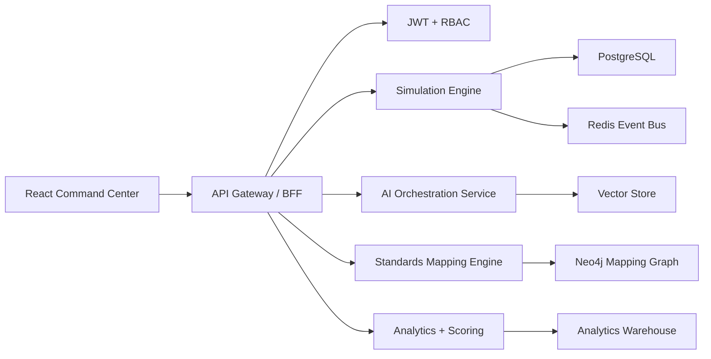

# Production Architecture

## Product Positioning

The platform is an AI-native operational resilience simulation ecosystem for enterprises, government, healthcare, BFSI, telecom, SaaS, defense, smart cities, and critical infrastructure. It converges cyber defense, AI governance, crisis management, data protection, continuity, disaster recovery, and executive decision simulation.

## Modular Architecture

## Core Services

- Simulation Engine: scenario orchestration, timed injects, branching, mutation, role paths, exercise clock, state snapshots.
- AI Threat Simulation: prompt injection, RAG poisoning, hallucination, model poisoning, synthetic identity, deepfake, shadow AI, AI supply chain.
- Cyber Resilience: ransomware, cloud attacks, insider threat, zero trust, SOC workflow, hunting, lateral movement.
- GRC & Compliance: audit readiness, board exercises, policy failure, regulatory response, AI governance audits, third-party risk.
- BCDR: RTO/RPO modeling, dependency maps, recovery sequencing, cross-region failover, service priority scoring.
- Crisis Management: media, regulator, investor, executive comms, misinformation, public trust, geopolitical escalation.
- Data Protection: privacy incidents, AI data leakage, sovereignty conflicts, cross-border transfer, RAG leakage.
- Analytics: maturity scores, trust integrity, recovery effectiveness, ATT&CK coverage, compliance posture.

## Backend Decisions

- Node.js and Express for this scaffold; production can graduate to NestJS or Fastify modules.
- PostgreSQL is the system of record for tenants, users, scenarios, injects, decisions, controls, reports, and audit events.
- Redis drives live simulation timing, facilitator events, collaboration state, and websocket fanout.
- Neo4j stores relationships between attack techniques, controls, standards, assets, business services, and dependencies.
- Vector database stores scenario patterns, prior after-action reports, playbooks, regulatory examples, and facilitator memory.
- Object storage holds report exports, media injects, evidence packs, and generated artifacts.

## Frontend Decisions

- React and TypeScript app with role-aware command-center navigation.
- TailwindCSS for design tokens and responsive density.
- Framer Motion for state transitions during live exercise changes.
- Recharts for radar charts, coverage bars, heatmaps, and maturity trends.
- UI surfaces: live timeline, inject console, executive decision queue, attack map, standards navigator, scenario builder, after-action report workspace.

## SaaS Tenant Model

- Tenant has isolated users, roles, scenarios, assets, control mappings, evidence, reports, and AI memory partitions.
- Default roles: CISO, CIO, Board, SOC Analyst, Risk Manager, Compliance Officer, Incident Responder, Privacy Officer, BCM Manager, AI Governance Officer.
- Plans: Launch, Scale, Sovereign.
- Sovereign deployments support region pinning, customer-managed keys, private model endpoints, and isolated vector collections.

## RBAC Model

- Platform Admin: global platform configuration.
- Tenant Admin: tenant setup, integrations, users, billing.
- Exercise Director: create scenarios, launch simulations, generate reports.
- Facilitator: manage injects, role prompts, mutations.
- Participant: respond to assigned decisions and injects.
- Observer/Auditor: read-only access, evidence review, compliance export.

## Security Architecture

- JWT access tokens, refresh token rotation, SSO/SAML/OIDC for enterprise.
- Per-tenant authorization checks on every query.
- Immutable audit logging for auth, scenario changes, inject delivery, AI generation, report exports, and admin actions.
- Encryption in transit and at rest; customer-managed keys for Sovereign plan.
- AI safety layer logs prompts, redacts sensitive evidence, blocks unsafe generation, and records model provenance.
- Rate limits and abuse detection on AI generation and public API endpoints.

## Deployment Architecture

- Web app on CDN plus edge WAF.
- API services on Kubernetes or managed containers.
- PostgreSQL with read replicas and PITR.
- Redis cluster for eventing and live simulation sessions.
- Neo4j managed cluster for mapping graph.
- Vector store with tenant-isolated namespaces.
- Observability: OpenTelemetry, central logs, traces, metrics, SLO dashboards.

## Scaling Strategy

- Partition by tenant and simulation session.
- Keep live exercise state in Redis, durable state in PostgreSQL.
- Async workers generate reports, media injects, standards mappings, and scoring recalculations.
- Use websocket channels per simulation and role.
- Cache framework mapping graph traversals and common score computations.
